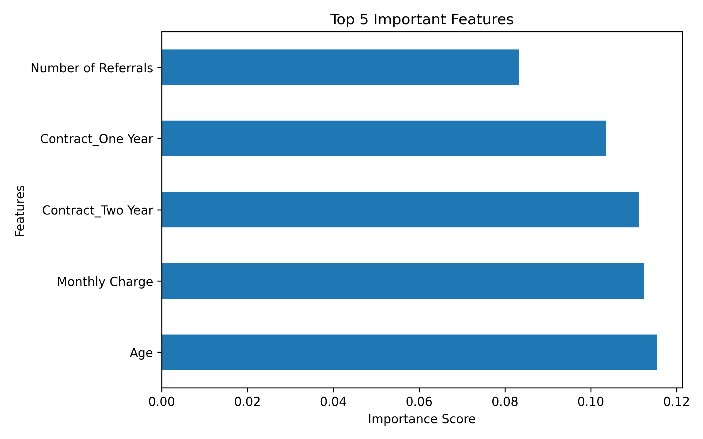
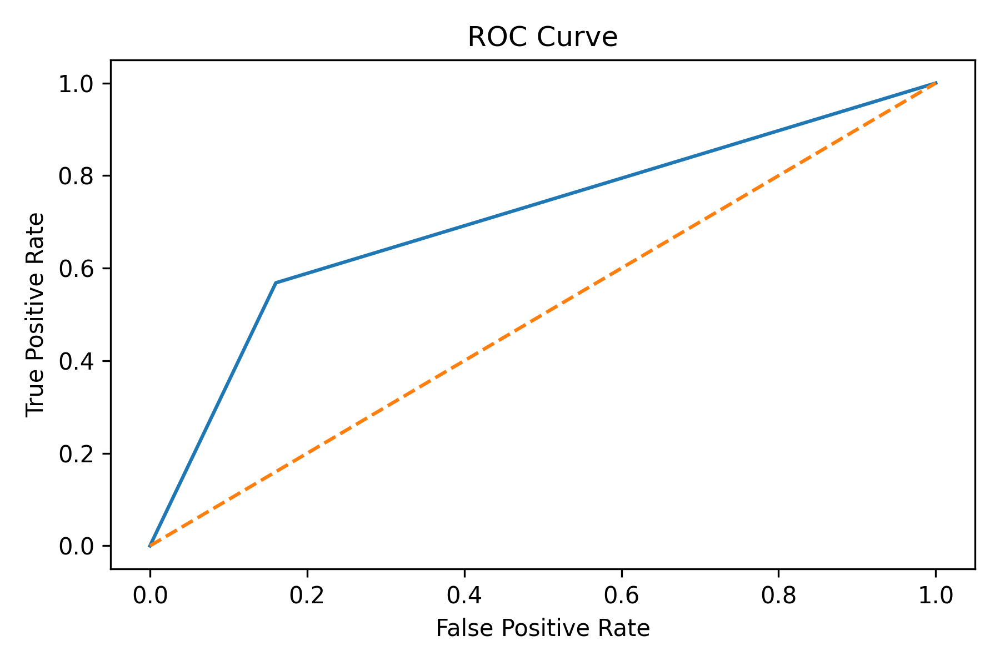
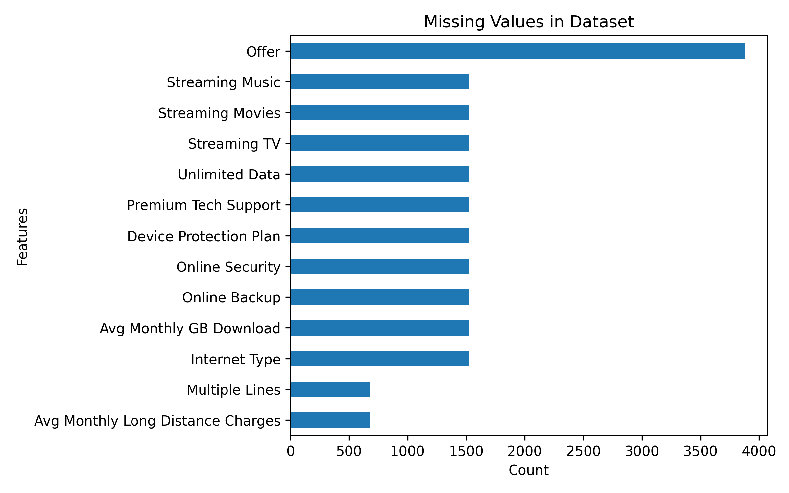
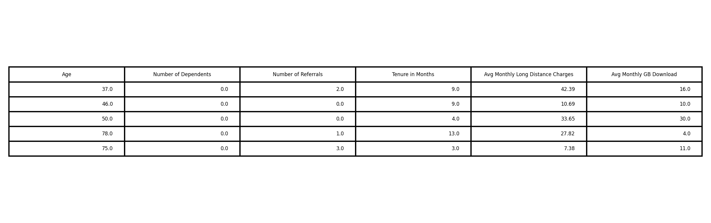

# 📊 Customer Churn Prediction (Business Retention Model)

## 🚀 Project Overview

This project focuses on predicting whether a telecom customer will churn (leave) or stay using a Decision Tree Classifier.

Customer churn prediction helps businesses take proactive actions to retain customers and reduce revenue loss.

---

## 📂 Dataset

Dataset used: Telecom Customer Churn Dataset  
Source: https://www.kaggle.com/datasets/shilongzhuang/telecom-customer-churn-by-maven-analytics  

- 7043 customers  
- 37 features  

---

## ⚙️ Workflow

- Data Exploration and Analysis  
- Missing Values Handling (Mean & Mode)  
- One-Hot Encoding for categorical variables  
- Train-Test Split (80/20)  
- Decision Tree Model Training  
- Model Evaluation (Accuracy, Precision, Recall, F1-score)  
- ROC Curve & ROC-AUC Analysis  
- Feature Importance Analysis  

---

## 🧠 Model Used

- Decision Tree Classifier

---

## 📈 Model Performance

- Accuracy: 76.8%  
- Precision: 56.1%  
- Recall: 56.8%  
- F1 Score: 56.5%  
- ROC-AUC Score: 0.70  

---

## 📊 Visualizations

### 🔹 Feature Importance

### 🔹 ROC Curve

### 🔹 Missing Values Analysis

### 🔹 Dataset Preview

---

## 🔍 Key Insights

- Contract type significantly affects churn  
- Customers with high monthly charges are more likely to churn  
- Short-term contracts increase churn risk  
- Customer referrals indicate loyalty  

---

## 💡 Business Recommendations

- Offer discounts for long-term contracts  
- Improve customer support for high-risk users  
- Provide loyalty programs  
- Optimize pricing strategies  

---

## 🛠️ Technologies Used

- Python  
- Pandas  
- NumPy  
- Matplotlib  
- Seaborn  
- Scikit-learn  

---

## 📦 Project Structure
Customer-Churn-Prediction/
│
├── notebook.ipynb
├── README.md
├── requirements.txt
├── report.pdf
│
├── images/
│ ├── feature_importance.png
│ ├── roc_curve.png
│ ├── missing_values.png
│ ├── dataset_preview.png

---

## 📌 Conclusion

This project demonstrates how machine learning can be used to predict customer churn and extract actionable business insights.

The model provides a solid baseline and highlights the importance of data preprocessing and feature analysis.

---

## 🔗 GitHub Repository

https://github.com/mubashir-azeem/BlackByte-Internship/tree/main/Project%20-%20Customer%20Churn%20Prediction%20(Business%20Retention%20Model)
